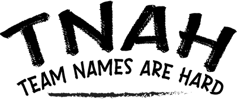

<p align="center">
    
</p>

<p align="center">
<a href="/actions/workflows/Windows.yml">
    
</a>
</p>

---

<p align="center">
    <a href="#minimal">Minimal</a> •
    <a href="./wiki">Wiki</a> •
    <a href="#goals">Goals</a> •
    <a href="./wiki/Build">Build</a> •
    <a href="#dependencies">Dependencies</a> •
    <a href="./LICENSE">License</a>
</p>

---

## Minimal

This minimal fork is designed to leverage the core structure and functions of the original engine but strip out some of the more advanced game engine aspects to target more light-weight GUI apps that don't need or require said aspects of the original engine.

## About

TNAH is a game engine written in C++ targeting OpenGL 4.6. The TNAH name stands for ***T***eam ***N***ames ***A***re ***H***ard and is a continuation of the group name used during the development of the engine for university.

## History

This project originally started development in early 2021 as a university project but has since become a passion project moving forward. To view the original version of this engine visit our [original repo TNAH-Engine](https://github.com/BryceStandley/TNAH-Engine)

## Wiki

Visit the [wiki](/wiki/) to read up on example applications, build instructions and much more! You can also visit our [Documentaion](docs/index.html) page to view our [Doxygen](https://www.doxygen.nl/index.html) generated output.

## Goals

The goal of the TNAH engine is to provide a simple yet powerful application engine not only targeting game development but also any application you can think of! Some goals moving forward:

1. Remove any unnecessary components originally created for the original university build.
2. Major code clean up. (Many corners were cut when deadlines were approching)
3. Transition the engine to a dynamic library for easy distribution/integration.
4. Add proper application build runtimes.
5. Rewrite a large portion of Doxygen comments.

## LFS

Ensure git lfs is installed on your system prior to cloning. Head over to the [LFS](https://git-lfs.github.com/) github page to learn more about installing git lfs. Once installed on your machine, use:

```bash
git lfs install
```

## Cloning

1. ```bash
    git clone https://github.com/BryceStandley/TNAH.git
    ```

2. ```bash
    cd TNAH
    ```

3. If you would like to use the most up-to-date but possibly unstable version of the engine, use:
  
   ```bash
        git checkout dev
    ```

    ***Note*** The dev branch is a **unstable** work-in-progress. __Advanced experience is advised!__

4. ```bash
    git submodule update --init --recursive --depth 1
    ```

## Building

Cmake is used to build the engine and its modules. Head over to the [Build](/wiki/Build) section of the [Wiki](/wiki/) to learn about how to build the engine from source!

## Work In Progress

The TNAH engine is an ongoing development project which will see additions of may different components and models.

## Dependencies

- [Assimp](https://github.com/assimp/assimp) (3D Model/Mesh Loading Library)
- [Entt](https://github.com/skypjack/entt) (Entity Component System Library)
- [GLFW](https://github.com/glfw/glfw) (Window Management Library)
- [GLM](https://github.com/g-truc/glm) (3D Math Library)
- [ImGui](https://github.com/ocornut/imgui) (GUI Library)
- [ImGuizmo](https://github.com/CedricGuillemet/ImGuizmo) (Gizmo ImGui Addon)
- [KTX-Software](https://github.com/KhronosGroup/KTX-Software) (KTX Texture Loader)
- [SPDLOG](https://github.com/gabime/spdlog) (Console Logger Library)

## License

This project is licensed under the GNU GPL3 license. Please refer to the [License](/LICENSE) file for details.
